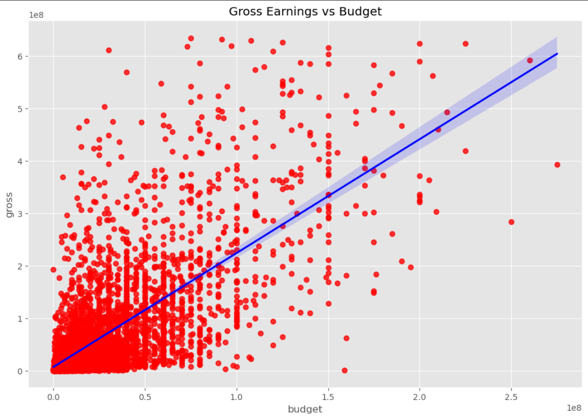
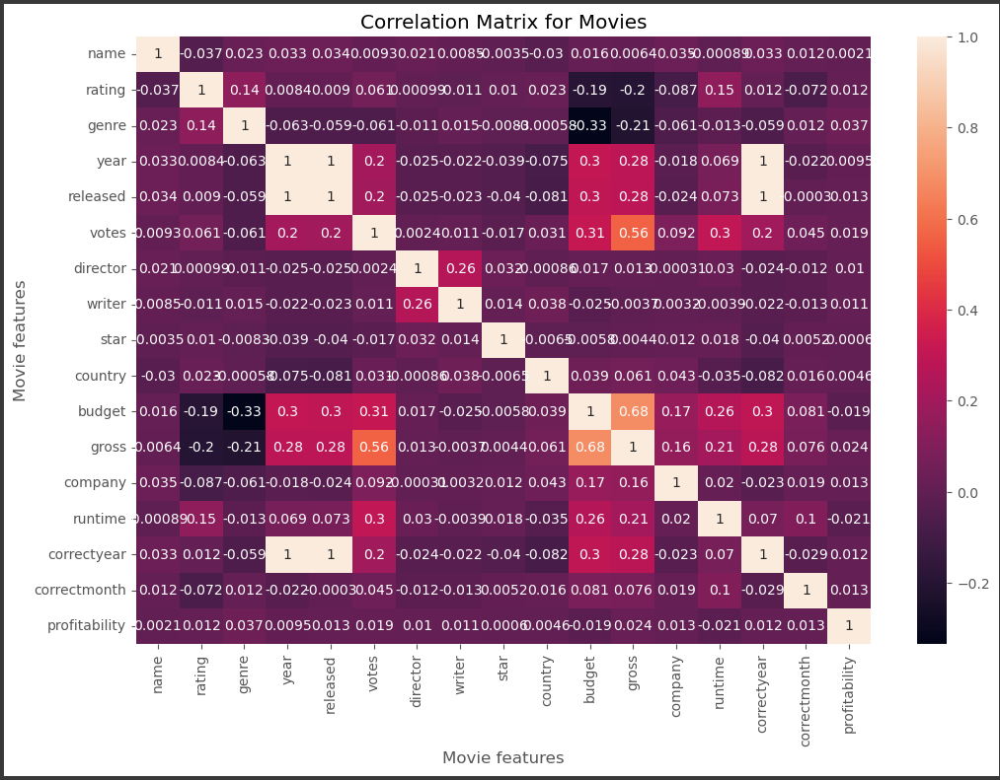
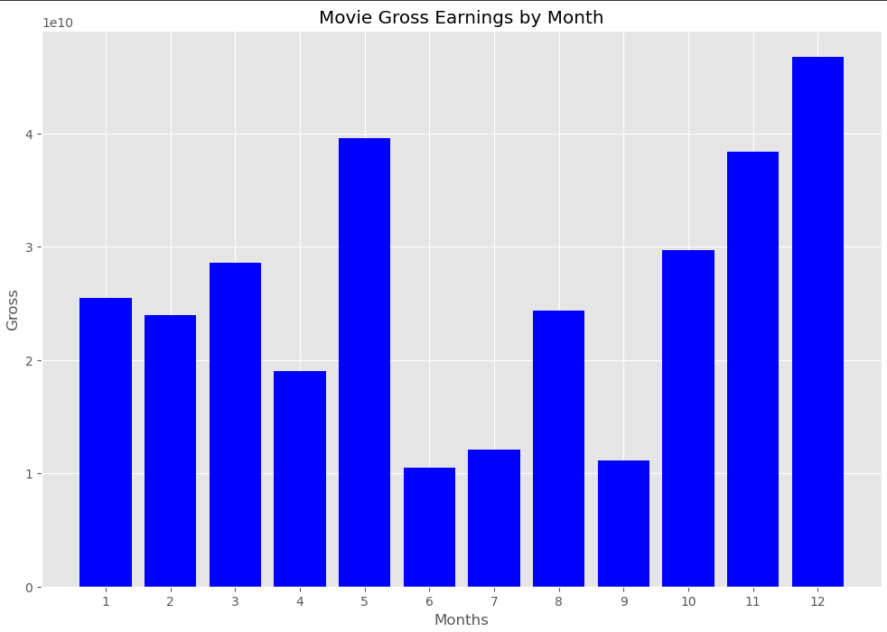
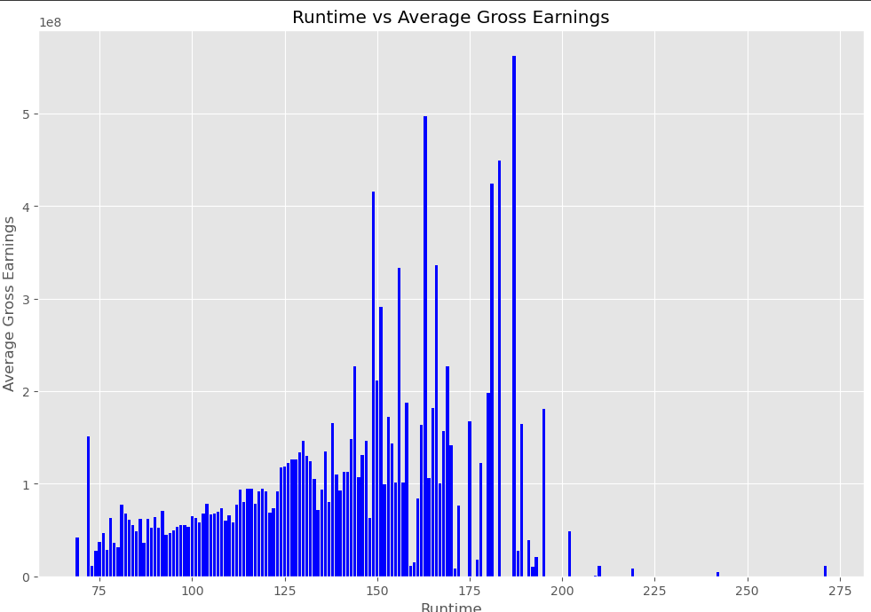
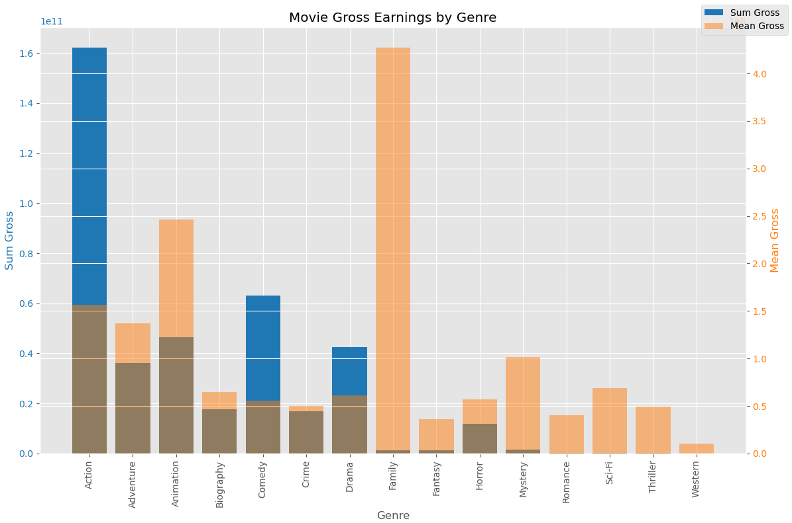

# The Blueprint of Movie Success: Insights from Data-Driven Analysis

## 1. INTRODUCTION
The film industry is a global powerhouse, generating over $90 billion in annual revenue, yet the formula for a movie’s success remains far from guaranteed. Even with significant investments sometimes exceeding $200 million and the involvement of A-list talent, many films fail to meet financial or critical expectations. While factors like budget, cast, genre, release timing, and marketing are widely considered important, their true impact can only be understood through rigorous data analysis.

This project takes a data-driven approach to uncover what truly contributes to a movie's success. By analyzing historical data from more than 5,000 films released between 2000 and 2024, the objective is to surface meaningful patterns and trends that can support smarter decision-making. These insights aim to assist studios, producers, and streaming platforms in navigating an increasingly competitive and digitally-driven entertainment landscape with greater confidence and clarity.

## 2. GOAL
The aim of this project is to uncover and analyze the key factors that contribute to a movie’s success. By leveraging data analysis and predictive modeling, the project seeks to provide clear, evidence-based insights into what truly influences a film’s performance. These insights are intended to support studios, producers, and marketing teams in making more informed decisions and optimizing their strategies for future releases.

## 3. KEY QUESTIONS

- Which key factors, including genre, budget, and release date, have the biggest impact on a movie’s box office success?
- What is the best time of the year to release a movie?
- What is the Ideal runtime for a movie?
- What genre of movie had the most success on average?
- What genre of movie has the most success Overall?

## 4. DATA COLLECTION AND PROCESSING

### Data Sources
- **IMDb** – Metadata including genre, director, cast, and ratings  
- **Kaggle Datasets** – Supplemental film datasets
  
 ### Data Processing Steps
- Handlling missing values and outliers.
- Removing duplicates and null values.
- Changing data types for specific columns and creating new ones.
- Updating columns to numeric values for correlation matrix
  
## 5. EXPLORATORY DATA ANALYSIS
### Gross Earning by Budget

The grapgh above reveals that there is a significant relationship between the budget abd gross earnings of a movie

### Correlation Matrix for movies

The heatMap reveals the correlation matrix for movies, we can deduct that the factors contributing to the success of a movie are votes and budgets, as they tend to have the highest correlation, It is also worthy to notes that, Company, movie name and genre had no correlation.

### Movie Gross Earning by Month

From the graph we can deduct, that the months with the Highest gross earnings are:
  - December(12)
  - May(5)
  - November(11)
    
 Hence, the best time to release a movie is **December** based on the overall gross earning in the period

### Runtime Vs Average Gross Earnings

The graph indicates that movies with a runtime between 160 - 190 minutes produced the highest gross earnings.

### Movie Gross Earning by Genre

The graphs shows that Action genre had the highest level of success across all movies, whereas the Family genre had the highest average success

## 6. KEY INSIGHTS

- **Budget** and **Votes** are strong predictors of revenue.  
- In terms of timing for the release of a movie, **December** was the most valuable, as it yielded the highest overall gross earning.
- High-profile directors and actors have a **positive impact**, particularly in action and drama genres.  
- **Action** and **Family** genre had the highest level of success across all movies.  

## 7. Limitations

- Streaming viewership and marketing spend data were incomplete.  
- External variables like global events or competing releases weren’t fully captured.  
- Cultural shifts and social media trends weren’t included but may play a major role.
